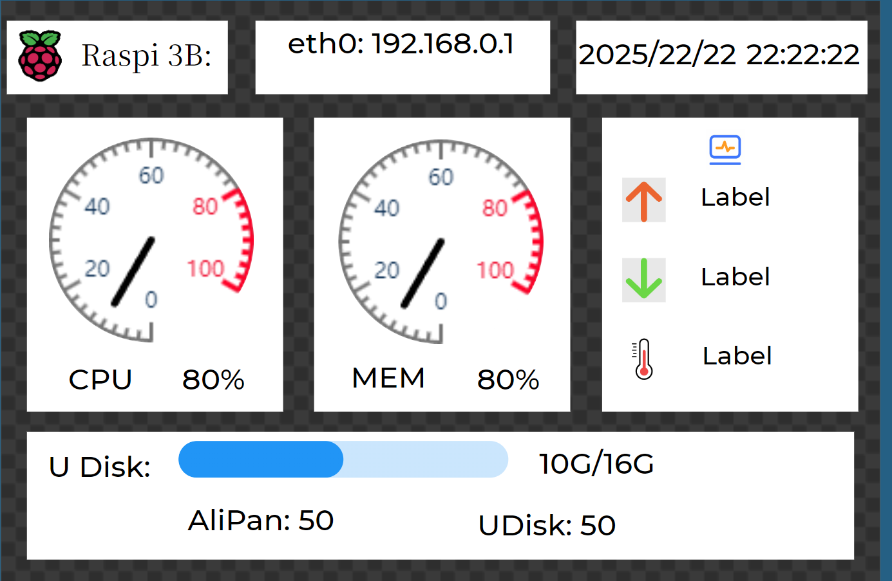
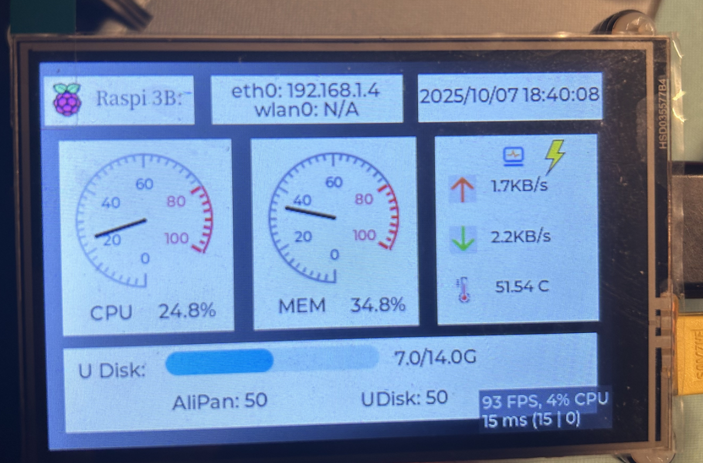

# 树莓派MHS35屏幕设备监控

## 基本介绍：

目录介绍：

- GuiGuider_Project： 存放的使用gui-guider创建的模版
- Lvgl_v9.3_Project：基于LVGL 9.3版本进行更改的设备展示demo

设备介绍：

- 树莓派3B
- MHS35 LCD屏幕

前置依赖：

- MHS35 LCD驱动安装
- tslib-dev库安装（本次项目仅展示，也可以将其去除，不影响本次展示）

## 展示效果

### Gui-Guider设置展示：

### 实物展示：

## 参考文档：

- https://github.com/Temperature6/DevMonitor_for_Pis